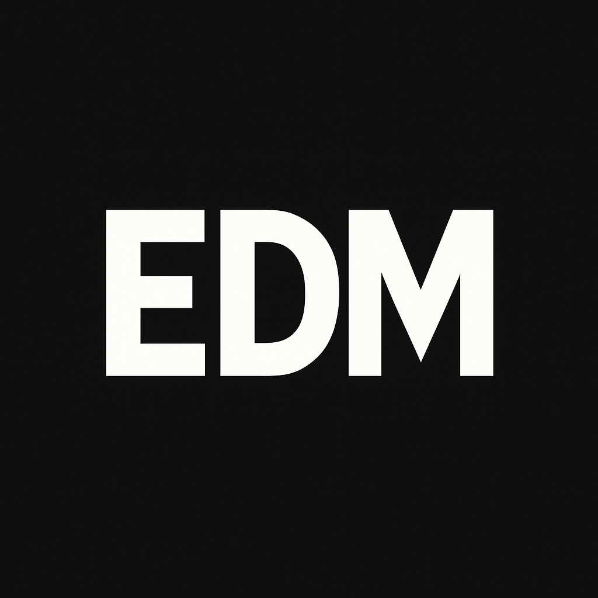

<a name="readme-top">

<br/>

<br />

  <a href="https://github.com/elijahdelmundo">
  <!-- TODO: If you want to add logo or banner you can add it here -->
    
  </a>


  <h3 align="center">WD-SeatWork-1</h3>
</div>
<This project showcases proficiency in HTML and CSS through various page layouts, each featuring different header and footer designs inspired by popular websites.
<div align="center">
 
</div>

<br />

 


[](https://wakatime.com/badge/user/018dd99a-4985-4f98-8216-6ca6fe2ce0f8/project/63501637-9a31-42f0-960d-4d0ab47977f8)

---

<br />
<br />

<!-- TODO: If you want to add more layers for your readme -->
<details>
  <summary>Table of Contents</summary>
  <ol>
    <li>
      <a href="#overview">Overview</a>
      <ol>
        <li>
          <a href="#key-components">Key Components</a>
        </li>
        <li>
          <a href="#technology">Technology</a>
        </li>
      </ol>
    </li>
    <li>
      <a href="#rule,-practices-and-principles">Rules, Practices and Principles</a>
    </li>
    <li>
      <a href="#resources">Resources</a>
    </li>
  </ol>
</details>

---

## Overview

<!-- TODO: To be changed -->
<!-- The following are just sample -->
Description of the project in details.

Guiding Question:
- What is the project
- Whats the purpose
- What are key components
- What technology used and how it is used

### Key Components
<!-- TODO: List of Key Components -->
<!-- The following are just sample -->
- MultiPage Website/Single Page Website
- Parallax transition
- Transactional

### Technology
<!-- TODO: List of Technology Used -->


## Rules, Practices and Principles
1. Always use `WD-` in the front of the Title of the Project for the Subject followed by your custom naming.
2. Do not rename any .html files; always use `index.html` as the filename.
3. Place Files in their respective folders.
4. All file naming are in camel case.
   - Camel case is naming format where there is no white space in separation of each words, the first word is in all lower case while the succeding words first letter are in upper followed by lower cased letters.
   - ex.: buttonAnimatedStyle.css
5. Use only `External CSS`.
6. Renaming of Pages folder names are a must, and relates to what it is doing or data it holding.
7. File Structure to follow below.

```
WD-ProjectName
└─ assets
|   |
|   └─ IMG
|   |   └─ fp/kawa/mcdo/sb/ufc.png/WP.jpg
|   └─ js
|       └─ script.js
└─ pages
|  └─ head1 -> head5
|     | └─index.html 
|     | └─style.css
|
└─ index.html
└─ readme.md
└─ style.css

## Resources


References
|-|
Head 1 https://www.ufc.com/athletes
Head 2 https://www.mcdonalds.com.ph/
Head 3 https://www.starbucks.com/
Head 4 https://www.foodpanda.ph/
Head 5 https://www.kawasaki-lifestyle.com/
